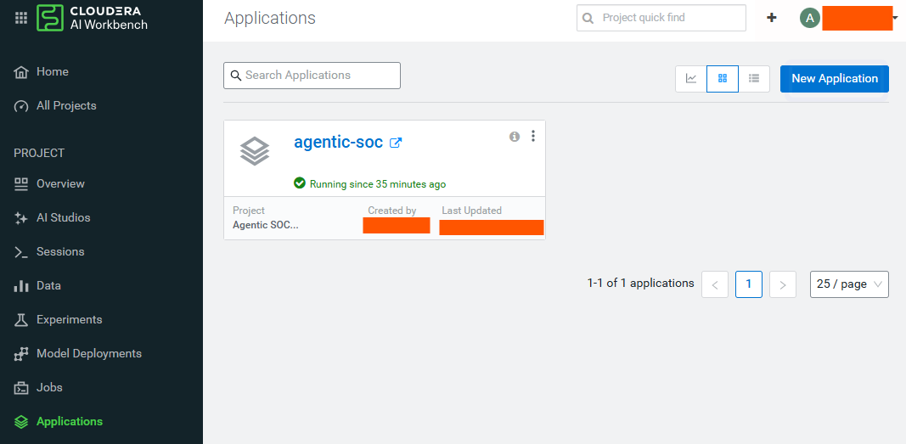
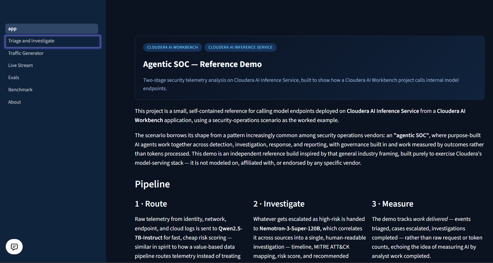
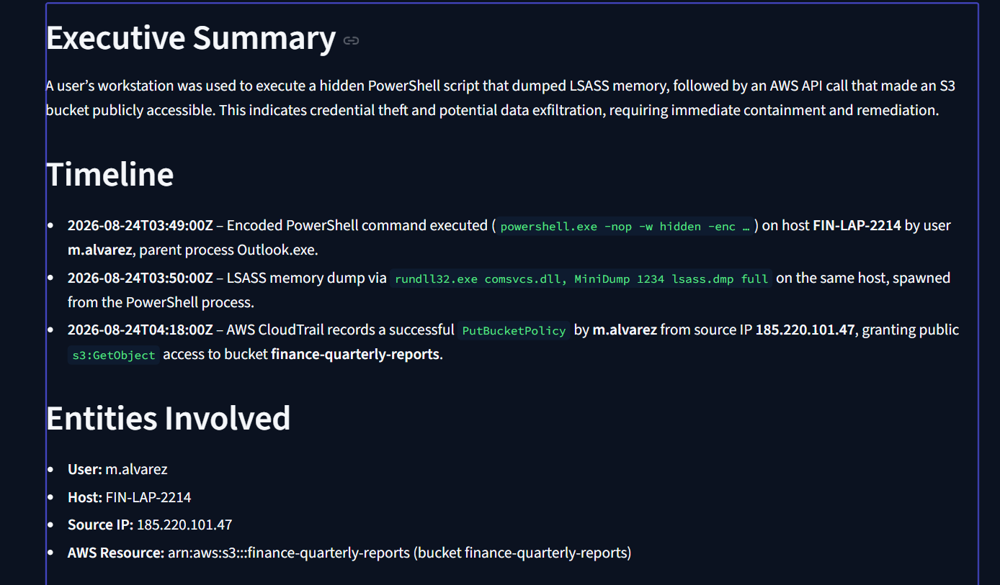
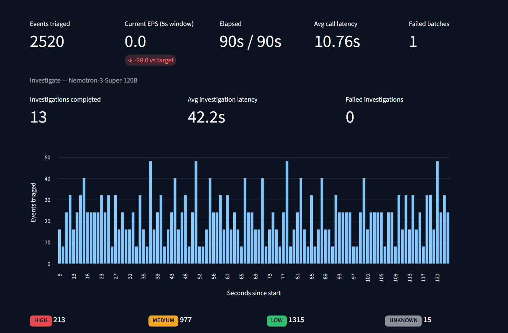
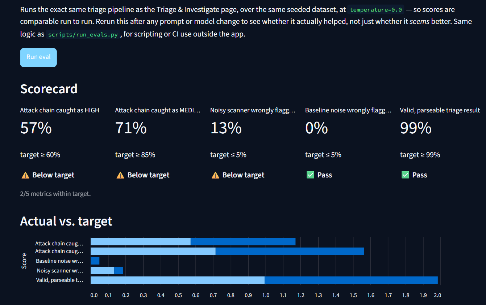

# Agentic SOC Reference Demo

[](#)
[](LICENSE)
[](#)
[](https://github.com/athpra/agentic-soc-demo)

<!-- <p align="center">
        
</p> -->

## Table of Contents

- [Overview](#overview)
- [Demo](#demo)
- [Use Case](#use-case)
- [Key Features](#key-features)
- [Quickstart / Guide](#quickstart--guide)
- [Architecture / Software Components](#architecture--software-components)
- [Target Audience](#target-audience)
- [Repository Structure](#repository-structure)
- [Prerequisites](#prerequisites)
- [Hardware Requirements](#hardware-requirements)
- [Documentation](#documentation)

## Overview

A small reference project showing how a **Cloudera AI Workbench** project calls model
endpoints served by **Cloudera AI Inference Service**, using a security-telemetry
analysis scenario as the worked example. It runs a two-stage pipeline — fast triage of
every raw event, then deep investigation of whatever gets escalated — over synthetic SOC
log data, and is built purely to exercise Cloudera's model-serving stack end-to-end.

## Demo

No recorded walkthrough yet, but here's the pipeline running live end-to-end on a
deployed Cloudera AI Workbench Application:

<p>
        
</p>
<p><em>Deployed as a Cloudera AI Workbench Application.</em></p>

<p>
        
</p>
<p><em>Home page — pipeline overview and endpoint health check.</em></p>

<p>
        
</p>
<p><em>Stage 2 output — a correlated, evidence-based investigation report.</em></p>

<p>
        
</p>
<p><em>Live Stream page — sustained real triage + investigation traffic.</em></p>

<p>
        
</p>
<p><em>Evals page — the triage scorecard against ground-truth labels.</em></p>

Run it yourself locally (see **Quickstart** below) or deploy it as a Cloudera AI
Workbench Application — the **Try it** section on the home page links to every
interactive page shown above.

## Use Case

Security operations teams process far more raw telemetry than analysts can review by
hand. This demo shows a pattern for handling that: route every event through a fast,
cheap model for risk scoring, and only hand the small fraction that's actually
interesting to a slower, higher-reasoning model for correlated investigation — instead
of treating every log line the same, or sending everything to the expensive model.

The framing — route by value, investigate with a governed agent, measure work delivered
rather than tokens processed — borrows from a general "agentic SOC" pattern several
security operations vendors describe publicly. See [`pages/6_About.py`](pages/6_About.py)
for that framing in more detail and an explicit disclaimer: **this project is an
independent reference build and is not modeled on, affiliated with, or endorsed by any
specific security operations vendor.**

## Key Features

- **Two-stage pipeline**: `Qwen2.5-7B-Instruct` for fast, cheap risk-scoring of every raw
  event; `Nemotron-3-Super-120B` for deep, correlated investigation of what gets escalated.
- **Work-delivered metrics**: tracks events triaged, cases escalated, and investigations
  completed, rather than raw request or token counts.
- **Live and load-test tooling**: a configurable concurrent traffic generator and a
  sustained events/sec live-stream dashboard for exercising real endpoint behavior.
- **Deterministic evals**: a repeatable scorecard against ground-truth labels, rerunnable
  after any prompt or model change.
- **Cross-platform benchmark**: the same model weights compared across Cloudera AI
  Inference and Fireworks AI, isolating serving-stack differences from model differences.

## Quickstart / Guide

1. Clone the repository.
2. Install dependencies and run locally:

   ```bash
   python3 -m venv .venv && source .venv/bin/activate
   pip install -r requirements.txt
   export CDP_TOKEN=<your Cloudera AI token>   # only needed outside CML — see docs/auth.md
   streamlit run app.py
   ```

3. Or deploy it as a Cloudera AI Workbench Application — see **Deploying on Cloudera AI
   Workbench** below.

### What's in the app

- **Home** (`app.py`) — overview, pipeline explanation, one-click endpoint health check.
- **Triage & Investigate** (`pages/1_Triage_and_Investigate.py`) — load the bundled
  synthetic telemetry, run Stage 1 triage, review scored results, escalate to Stage 2
  investigation, and read the generated report.
- **Traffic Generator** (`pages/2_Traffic_Generator.py`) — fires a configurable number of
  concurrent requests at either or both endpoints so you can watch latency, throughput,
  and utilization on the endpoint side.
- **Live Stream** (`pages/3_Live_Stream.py`) — sustains a target events/sec of real triage
  calls against the live endpoint, with a live-updating throughput dashboard.
- **Evals** (`pages/4_Evals.py`) — runs the deterministic triage eval and visualizes the
  scorecard, including a trend across any previously saved runs. See
  [docs/evals.md](docs/evals.md).
- **Benchmark** (`pages/5_Benchmark.py`) — compares Qwen2.5-7B-Instruct's latency,
  throughput, and triage quality across Cloudera AI Inference and Fireworks AI. See
  [docs/benchmark.md](docs/benchmark.md).
- **About** (`pages/6_About.py`) — the "agentic SOC" framing this demo borrows from, and a
  plain statement of what the project is and isn't.

### Deploying on Cloudera AI Workbench

1. Create a new Project from this repository (or upload the files directly).
2. **Session (quick test):** launch a Python session, run `pip install -r requirements.txt`,
   then `streamlit run app.py --server.port $CDSW_APP_PORT --server.address 127.0.0.1` from
   the session terminal, and open it via the session's application preview.
3. **Application (persistent demo):** in the Project, go to **Applications → New
   Application**, and set:
   - **Subdomain:** anything, e.g. `agentic-soc`
   - **Script:** `launch_app.py` — CML Applications run a Python script rather than an
     arbitrary shell command, so this small script just launches
     `streamlit run app.py` as a subprocess on the port CML assigns it.
   - **Build:** `cdsw-build.sh` is picked up automatically to install dependencies.
   - **Resource profile:** minimal CPU/memory is enough — this app only makes outbound
     calls to the inference endpoints, it doesn't run any models itself.
4. No environment variables are required for auth — the Application's own workload JWT
   is used automatically. See [docs/auth.md](docs/auth.md).

### Regenerating sample data

The bundled sample telemetry at `data/sample_logs.db` is generated deterministically
(seeded) from `src/log_generator.py`, which seeds one coherent multi-stage attack chain
(phishing → encoded PowerShell → beacon/exfil → new AWS access key → public S3 bucket) and
one red-herring noisy vulnerability scanner among routine baseline activity. To regenerate
after editing the generator:

```bash
python scripts/generate_sample_data.py
```

## Architecture / Software Components

```
 Synthetic SOC telemetry (data/sample_logs.db)
                │
                ▼
     ┌─────────────────────┐
     │   Stage 1 · Triage   │   Qwen2.5-7B-Instruct
     │  (Cloudera AI        │   fast, cheap risk-scoring
     │   Inference Service) │   of every raw event
     └──────────┬───────────┘
                │ escalate high-risk only
                ▼
     ┌─────────────────────┐
     │ Stage 2 · Investigate│   Nemotron-3-Super-120B
     │  (Cloudera AI        │   deep, correlated
     │   Inference Service) │   investigation report
     └──────────┬───────────┘
                ▼
     Streamlit app (Cloudera AI Workbench Application)
     Triage & Investigate · Traffic Generator · Live Stream
     Evals · Benchmark
```

Both stages call the same Cloudera AI Inference Service through an OpenAI-compatible
`/v1/chat/completions` API (see `src/llm_client.py`), authenticated with the workload JWT
Cloudera AI Workbench mounts automatically (see [docs/auth.md](docs/auth.md)) — the
app itself makes no local model calls and needs no GPU of its own. *A rendered diagram
image will replace the ASCII sketch above once one is added to `assets/`.*

## Target Audience

- Solution engineers demoing Cloudera AI Inference Service against a concrete,
  end-to-end scenario.
- Developers building their own Cloudera AI Workbench application against Cloudera AI
  Inference Service endpoints, looking for a worked reference.
- SOC/security engineering audiences interested in the "agentic SOC" triage-then-investigate
  pattern as applied narrative, not a product pitch.

## Repository Structure

| Path | Description |
| --- | --- |
| `app.py` | Home page / Streamlit entrypoint |
| `pages/` | Additional Streamlit pages (multipage app) |
| `frontend/` | Streamlit-specific presentation helpers (theming, header, badges) — kept separate from `src/`'s backend logic |
| `src/` | Backend logic: endpoint config/auth, LLM client, triage/investigation orchestration, synthetic data generator, evals, benchmark |
| `data/sample_logs.db` | Bundled synthetic sample telemetry (SQLite, regenerable) |
| `scripts/` | CLI entry points: regenerate sample data, run evals |
| `assets/` | Diagrams, screenshots |
| `deploy/` | Deployment notes (`cdsw-build.sh` and `launch_app.py` stay at repo root — see `deploy/README.md` for why) |
| `docs/` | Extended documentation (auth, evals, benchmark) |
| `METADATA.yaml` | Catalog metadata for the Cloudera blueprint website |
| `cdsw-build.sh` | Build script Cloudera AI Workbench runs on start |
| `launch_app.py` | Script CML Applications run to launch the Streamlit process |
| `requirements.txt` | Python dependencies |

## Prerequisites

- Access to a Cloudera AI Workbench workspace with two model endpoints already deployed
  on Cloudera AI Inference Service (or your own equivalent — see **Model endpoints**
  below to point the app at different ones).
- Python 3.10+ and `pip` for local development.
- For the cross-platform benchmark page only: a Fireworks AI account with an on-demand
  dedicated deployment of the same model (see [docs/benchmark.md](docs/benchmark.md)).

### Model endpoints

Configured in [`src/config.py`](src/config.py) against two endpoints already deployed on
Cloudera AI Inference Service (OpenAI-compatible `/v1/chat/completions` API):

- `Qwen/Qwen2.5-7B-Instruct` — fast triage
- `nvidia/nemotron-3-super-120b-a12b` — deep investigation

To point this at different endpoints or models, edit the `ModelConfig` entries at the top
of `src/config.py` — everything else in the app reads from that registry.

## Hardware Requirements

This app itself is a thin client — it makes outbound HTTP calls to already-deployed
inference endpoints and runs no models locally, so it needs minimal compute of its own.
The endpoints it calls are a separate, already-provisioned dependency:

| Deployment | Minimum |
| --- | --- |
| This Streamlit app (demo / launchable) | 1 vCPU, 2 GB RAM — no GPU |
| Qwen2.5-7B-Instruct endpoint (confirmed) | 1× A10G GPU |
| Nemotron-3-Super-120B endpoint (confirmed) | 4× A10G GPU |

## Documentation

- [docs/auth.md](docs/auth.md) — workload JWT auth, local dev token, troubleshooting.
- [docs/evals.md](docs/evals.md) — triage eval methodology and scored metrics.
- [docs/benchmark.md](docs/benchmark.md) — cross-platform (Cloudera AI Inference vs.
  Fireworks AI) benchmark methodology.

## Disclaimer

This project borrows the general shape of the "agentic SOC" pattern described publicly by
several security operations vendors, purely as scenario framing for the demo. It is an
independent reference build created to demonstrate Cloudera AI Workbench and Cloudera AI
Inference Service, is not modeled on, affiliated with, or endorsed by any specific security
operations vendor, and does not use, store, or connect to any real vendor product, data, or
customer information. All telemetry in this repo is synthetic.
